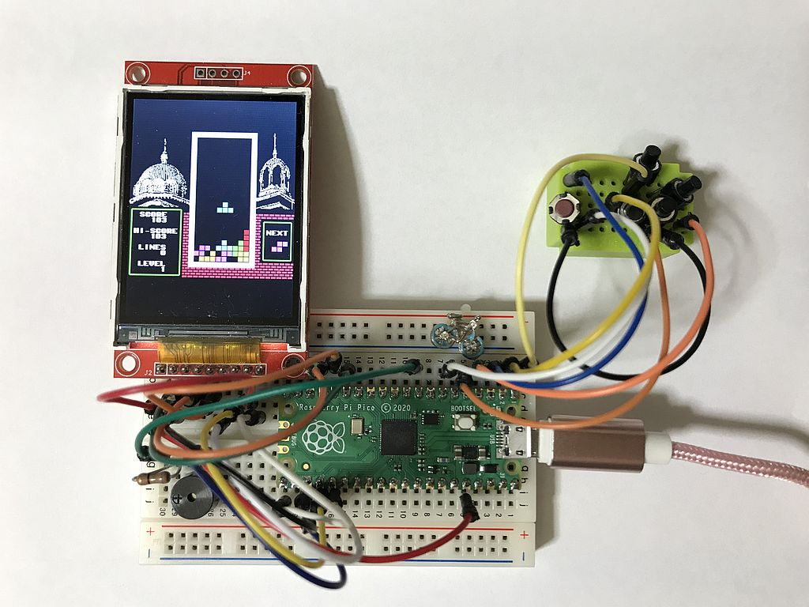
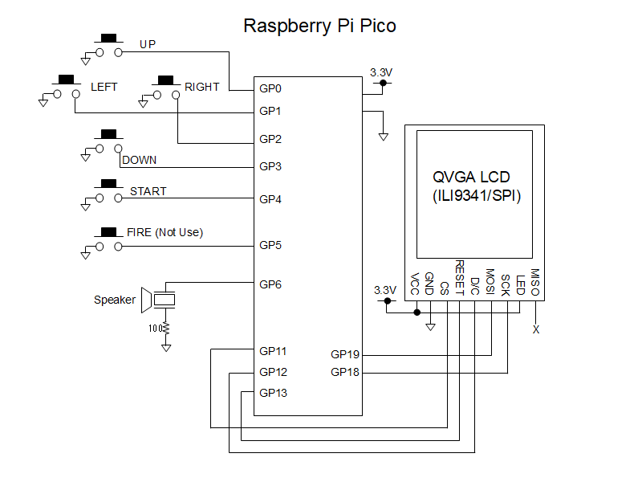

# Tetris for Raspberry Pi Pico
ラズベリーPi PicoにQVGAの液晶を接続して動作するテトリスです。  
小型スピーカーを接続して音声も鳴らせます。  
とてもシンプルな回路なので、簡単に製作することができます。  
液晶は240x320ドット、コントローラにILI9341を搭載したSPI接続のものに対応しています。  
  
## 実行方法
ラズベリーPi PicoのBOOTSELボタンを押しながらPCのUSBポートに接続し、バイナリーファイル tetrispico.uf2 をラズベリーPi Picoにコピーしてください。  
  
## ソースプログラムのビルド方法
ソースプログラムのビルドにはRP2040に対応したコンパイラの他、CMake、pico-sdkが必要です。  
SDKが使用できる環境設定をした上で、ダウンロードした拡張子が.c .h .txt .cmakeのファイルを同じフォルダに入れてビルドしてください。  
  
  
  
